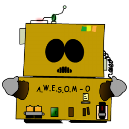
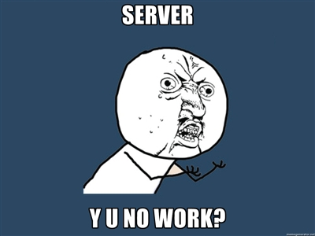

## AngularJS
### HTML++

--slide--

## Templates Are
## ${awesome}

--sub--
## JSP

Hello, ${user}

--sub--
## Ruby

Hello, <%= user %>

--sub--
## ASP

Hello, <%= user %>

--sub--
## HTML/JavaScript
 
?????

--slide--

## AngularJS:

    Hello, {{user}}

--slide--

<iframe style="width: 100%; height: 500px;background-color:white" src="http://angularjs.org" allowfullscreen="allowfullscreen" frameborder="0"></iframe>

--slide--

## No Server

 * Rich client apps
 * Variables kept up to date as they change
 * Quick development loop

--slide--

## Two-way Binding

    <input type="text" ng-model="user"/>
    Hello, {{user}}

 * Inputs bind to model data
 * Display is updated as model is changed
 * Like a spreadsheet

--slide--

## Demo - Hello World

<iframe style="width: 100%; height: 500px;background-color:white" src="http://jsfiddle.net/sberan/GEd5T/1/embedded/result,html/presentation/" allowfullscreen="allowfullscreen" frameborder="0"></iframe>

--slide--

## Advanced Templates

    <ul>
      <li ng-repeat="item in [1,2,3]">
        {{item}}
      </li>
    </ul>

Becomes:

    <ul>
     <li>1</li>
     <li>2</li>
     <li>3</li>
    </ul>

--slide--

## Controllers

    function MyController($scope) {
      $scope.greeting = 'Hello, world!';
    }

&nbsp;

    

        {{greeting}}
    

    

--slide--

## Server Communication

    function MyController($scope, $http) {
      $http.get('/greeting').success(function(data) {
        $scope.greeting = data;
      });
    }

&nbsp;

    

      {{greeting}}
    

    
--slide--

## Controllers Example

<iframe style="width: 100%; height: 500px;background-color:white" src="http://jsfiddle.net/sberan/ZVRUC/8/embedded/result,html,js/presentation" allowfullscreen="allowfullscreen" frameborder="0"></iframe>

--slide--

## No DOM Manipulation in Controllers

--slide--

## Directives

 * ng-model
 * ng-repeat
 * your-custom-directive

--slide--

## Elements Work Too

Custom directives can be used to create reusable components

    <tabbar>
      <tab name="Home" src="index.html"/>
      <tab name="About" src="about.html"/>
      <tab name="Contact" src="contact.html"/>
    </tabbar>

--slide--

## Directives Example

<iframe style="width: 100%; height: 500px;background-color:white" src="http://jsfiddle.net/sberan/ub9ea/13/embedded/result,html,js/presentation" allowfullscreen="allowfullscreen" frameborder="0"></iframe>

--slide--

## Testing

    describe('Buzz Client', function() {
      it('should filter results', function() {
        input('user').enter('jacksparrow');
        element(':button').click();
        expect(repeater('ul li').count()).toEqual(10);

        input('filterText').enter('Bees');
        expect(repeater('ul li').count()).toEqual(1);
      });
    });

--slide--

## Browser Support

 * Chrome, FF, Safari
 * IE 8+

--slide--

## W3C Spec:

 * Model Driven Views
 * Web Components

--slide--

## Thanks!

 * angularjs.org
 * github.com/angular/angular.js
